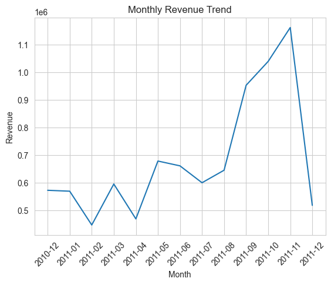

# E-Commerce Revenue & Customer Retention Analysis

## 📌 Business Problem

The company observed increasing marketing spend but only slow revenue growth. At the same time, customer retention appeared weak.

The objective of this analysis is to identify key revenue drivers, understand customer purchasing behavior, and provide data-driven recommendations to improve customer retention and overall profitability.

---

## 📁 Dataset

This project uses the **Online Retail Dataset** from the UCI Machine Learning Repository.

* Contains over 500,000 transactions
* Data from a UK-based e-commerce company
* Covers purchases between 2010 and 2011

Key columns include:

* InvoiceNo
* Description
* Quantity
* InvoiceDate
* UnitPrice
* CustomerID
* Country

---

## 🛠️ Tools & Technologies

* Python
* Pandas
* NumPy
* Matplotlib
* Seaborn
* Jupyter Notebook

---

## 🔍 Analysis Process

### 1. Data Cleaning

* Removed missing Customer IDs
* Filtered out canceled orders and returns
* Removed invalid values (negative quantity/price)
* Created a Revenue column

### 2. Exploratory Data Analysis (EDA)

* Analyzed revenue trends over time
* Identified top-performing products
* Evaluated sales by country
* Examined customer purchasing behavior

### 3. RFM Customer Segmentation

Customers were segmented based on:

* Recency (last purchase)
* Frequency (number of purchases)
* Monetary value (total spending)

Segments include:

* Champions
* Loyal Customers
* At Risk
* New Customers

### 4. Cohort Analysis

* Grouped customers by first purchase month
* Measured retention over time
* Built a retention heatmap to track customer behavior

### 5. Customer Lifetime Value (CLV)

* Calculated average order value
* Estimated purchase frequency
* Measured customer lifespan
* Computed CLV to evaluate customer worth

---

## 📈 Key Insights

* A small group of **Champions customers generates the highest share of revenue (~$4M)**
* **Loyal customers** contribute significantly and represent strong upsell potential
* A large portion of customers make only **one purchase**, indicating a retention issue
* Cohort analysis shows **sharp drop-off after the first month**, confirming weak retention
* Customer value is highly skewed, with a **small percentage driving most revenue**

---

## 💡 Business Recommendations

* Focus on retaining **high-value (Champions) customers** through loyalty programs
* Convert **Loyal Customers into Champions** using targeted promotions
* Re-engage **At-Risk customers** with personalized marketing campaigns
* Improve onboarding and engagement strategies to convert **New Customers into repeat buyers**

---

## 📊 Visualizations

### Monthly Revenue Trend



### Top Products by Revenue


### Revenue by Country


### Customer Segmentation


### Cohort Retention Analysis


### Customer Lifetime Value Distribution


---

## 📂 Project Structure

```
ecommerce-customer-analytics/
│
├── data/
├── notebooks/
├── images/
└── README.md
```

---

## 🚀 Conclusion

This project demonstrates how data analysis can be used to uncover key business insights, identify revenue drivers, and support strategic decision-making.

The findings highlight the importance of customer retention and the significant impact of high-value customers on overall business performance.


[def]: images/monthly_revenue_trend.png
